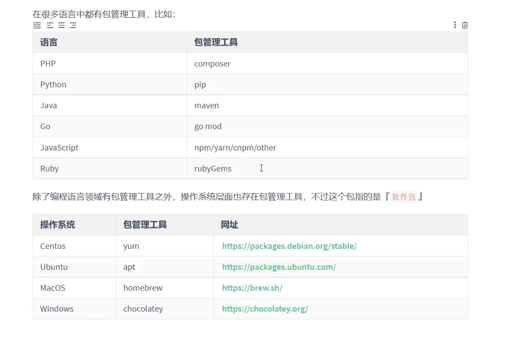
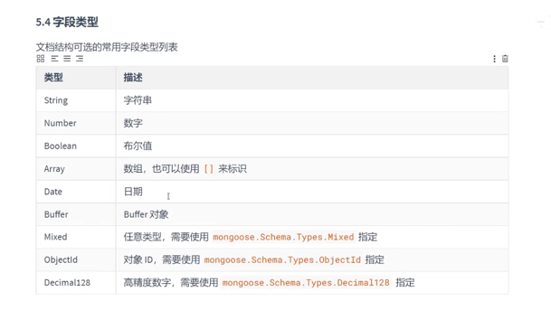
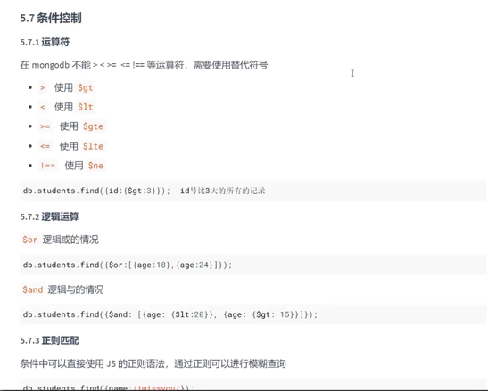
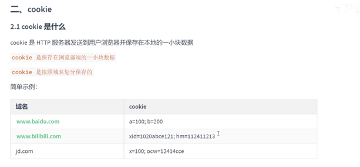
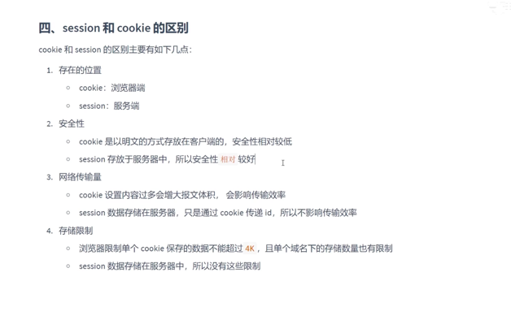
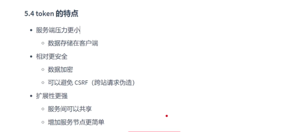
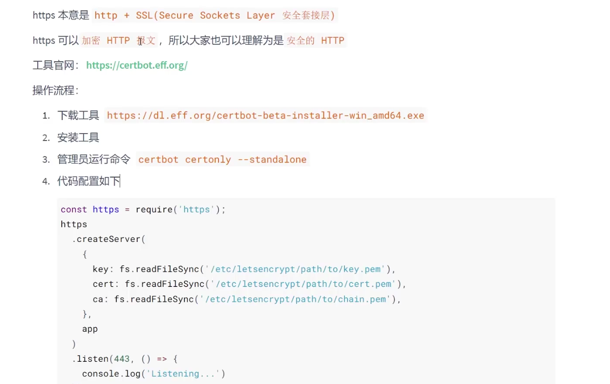
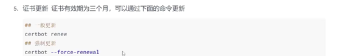

# node-study
nodejs-study

## 其他包管理工具



## nvm(node 版本 管理)

node js 版本管理很重要, 

### 常用命令
1. nvm list available

    查看nodejs 版本
2. nvm list 
    已经安装的Nodejs版本
3. nvm install ...
    安装版本,最新版可以使用latest
4. nvm uninstall
    卸载版本
2. nvm use 表示使用某一个版本
    切换nodejs 版本

## express js web应用开发框架

### 获取请求体内容

1. 安装 body-parser npm 包
2. 开始解析

    查看 express/body-parse 查看更多
### 路由模块化

1. 其实可以看作是一个express对象的子应用对象

查看 route-module 了解更多 ..

## ejs
查看模版引擎 template-engine 目录了解更多

## express 应用程序生成器
1. express-generator 全局安装

```shell
express -e 代码放到对应的文件夹(给出目录)
```

## express 处理文件上传

1. formidable 安装模块
2. 尝试使用此中间件解析
     


## lowdb 
通过json 来存储一些数据

这对于前端调试(数据模拟很有帮助) ...

有关lowdb的使用,查看 frameworks/lowdb的代码练习 ...

记住它的操作是懒的形式即可 ...


## mongodb

1. 安装mongoose.js 文档模型库  用来和mongodb 进行交互的库
2. 详情查看frameworks/mongodb 了解更多

3. 数据类型(常见的)

    

4. 查询中的操作符使用

    

    对于模糊查询使用的是regex 表达式 /..../ 正则表达式. ..

    其他的都还是比较简单 ...

### connect-mongo
还可以用它封装好的第三方库来连接Mongo

## restful api
1. 安装json-server
    ```shell
      npm install json-server -g
   ```
    可以用来快速搭建restful api的接口服务

2. 监视某一个json文件
    ```shell
      json-server --watch ....json
    ```
3. 然后访问产生的url地址

## cookie


### express 中解析cookie

1. 安装cookie-parser
2. 获取cookie
3. 详情查看 cookie-operations 目录中的代码

## session 管理
安装expression-session

### session 和 cookie 不同


## 跨域
cors 中间件解决问题 ...


## token




### jwt
1. 安装 jsonwebtoken 包操作 jwt
2. 查看jwt 目录下面查看更多

## https 报文加密



当然这只是一种工具,还有其他好用的ssl 证书生成工具 ...

// 注意创建服务器的包换成了 https

### 证书更新


更新完毕之后,可以继续使用 ...